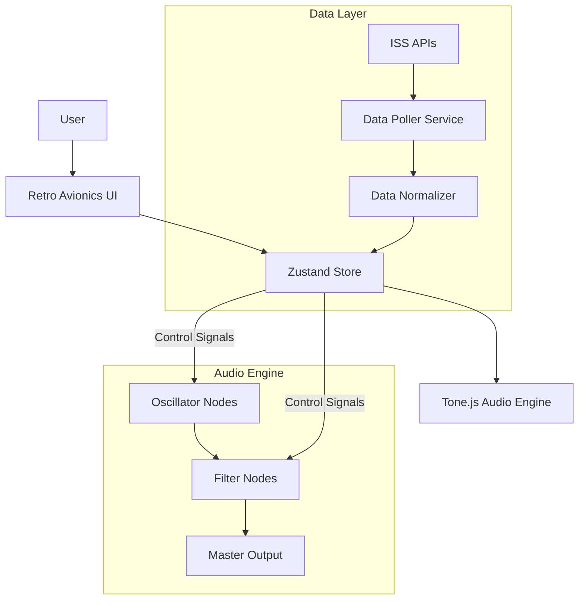

# ISS Data Synthesizer - Implementation Plan & Architecture

## Goal
Create a web-based modular synthesizer where sound parameters are modulated by live (or near-live) data from the International Space Station (ISS). The interface will mimic a retro avionics panel.

## Architecture Design

### High-Level Overview
The application follows a standard Single Page Application (SPA) architecture with a heavy emphasis on client-side audio processing.

### Core Components

1.  **The Rack (Container)**
    *   Acts as the main layout grid.
    *   Handles the visual "mounting" of modules.
    *   Contains the SVG layer for patch cables.

2.  **Modules (Functional Units)**
    *   **Generator Modules**: Produce sound (e.g., `VCO` - Voltage Controlled Oscillator).
    *   **Modulator Modules**: Produce control signals (e.g., `LFO`, `ISS Telemetry`).
    *   **Processor Modules**: Modify sound (e.g., `VCF` - Filter, `Delay`).
    *   **Utility Modules**: `Master Output`, `Mixer`.

3.  **The Patch System**
    *   Virtual "cables" connecting **Outputs** to **Inputs**.
    *   Visualized using SVG Bézier curves.
    *   Logic handled by connecting Tone.js nodes (`node.connect(destination)`).

4.  **ISS Data Bridge**
    *   Fetches data from external APIs (WhereTheISS.at, etc.).
    *   **Normalization**: Converts raw values (e.g., Altitude: 400km) to Audio-Rate or Control-Rate signals (0.0 to 1.0).
    *   **Interpolation**: Smooths data updates to prevent "stepping" artifacts in the sound.

## Tech Stack
*   **Frontend Framework**: React 18 + Vite
*   **Language**: JavaScript (ES6+)
*   **Audio Library**: **Tone.js** (Wrapper around Web Audio API).
*   **State Management**: **Zustand** (Transient updates for knobs/meters to avoid React render thrashing).
*   **Styling**: **Vanilla CSS / CSS Modules** (Strict control over retro look).
*   **Icons**: Lucide React (for UI elements).

## Data Strategy
Since real-time public telemetry is limited, we will use a hybrid approach:
1.  **Live Position**: `WhereTheISS.at` (Lat, Long, Alt, Velocity).
2.  **Derived Metrics**:
    *   *Day/Night Cycle*: Calculated from position (modulates "Temperature" proxy).
    *   *Solar Beta Angle*: Calculated from orbit.
3.  **Simulated/Proxy**:
    *   *Radiation*: Mapped to Geomagnetic Activity (Kp Index) from NOAA.
    *   *Magnetometer*: Perlin noise seeded by position or real historical loops.

## Step-by-Step Implementation Plan

### Phase 1: Foundation & Audio Engine
- [ ] **Step 1.1**: Initialize Vite Project & Install Dependencies (Tone.js, Zustand).
- [ ] **Step 1.2**: Set up the Global Store (`useSynthStore`) for managing modules and connections.
- [ ] **Step 1.3**: Create the `AudioEngine` singleton to manage the Tone.js context.
- [ ] **Step 1.4**: Implement the `MasterOutput` module (Volume, Mute, Visualizer).

### Phase 2: The Modular Framework
- [ ] **Step 2.1**: Create the generic `Module` UI shell (screws, faceplate).
- [ ] **Step 2.2**: Create `Knob` and `Port` components.
- [ ] **Step 2.3**: Implement `Oscillator` Module (Sine/Saw/Sqr, Freq Knob).
- [ ] **Step 2.4**: Implement the Patch Cable system (Drag-and-drop connections).

### Phase 3: ISS Data Integration
- [ ] **Step 3.1**: Create `ISSDataService` to fetch and normalize data.
- [ ] **Step 3.2**: Create `ISSModule` UI to visualize the data streams.
- [ ] **Step 3.3**: Connect `ISSModule` outputs to `Oscillator` inputs (e.g., Altitude -> Pitch).

### Phase 4: Polish & Retro UI
- [ ] **Step 4.1**: Implement "Avionics" design system (Fonts, glowing displays, metal textures).
- [ ] **Step 4.2**: Add visual feedback (LEDs blinking with data).
- [ ] **Step 4.3**: Optimize performance (minimize React renders during audio updates).

### Phase 5: Social & Sharing
- [ ] **Step 5.1**: Implement Audio Recording (MediaStreamDestination).
- [ ] **Step 5.2**: "Share Patch" feature (Serialize store to JSON/URL).

## User Review Required
> [!IMPORTANT]
> **Audio Context Policy**: Browsers require a user gesture (click) to start audio. We will need a "Start System" switch on the UI.

> [!NOTE]
> **Data Latency**: ISS position updates ~1/sec. We will interpolate values to create smooth modulation signals.
